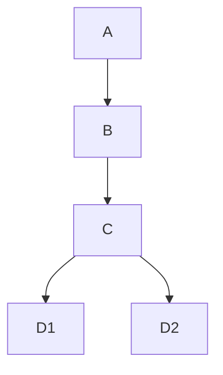

# Quirks
- kubler is not flexible for image tags, custom tagging and pushing to registry is treated outside kubler itself based on images.yaml
- build.conf is generated from images.yaml requirement definitions
- having an image with a single python version turned out to be harder than expected, but with some package.provieded entries, newuse and depclean it was finally successful
- since I like to avoid using ":latest" which is hard-coded and since I want to tag images with the version of the software but IMAGE_TAG is used for the parent-builder as well I decided to implement parts of kubler in ansible keeping the init phase (portage, stage) and using kubler-build-root script

