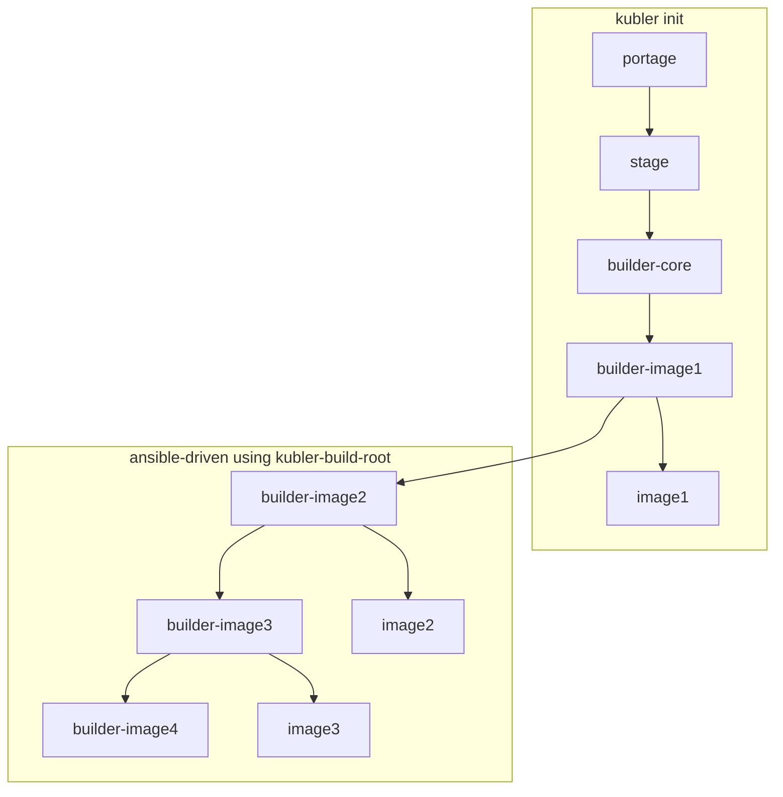

# Quirks
- kubler is not flexible for image tags, custom tagging and pushing to registry is treated outside kubler itself based on images.yaml
- build.conf is generated from images.yaml requirement definitions
- having an image with a single python version turned out to be harder than expected, but with some package.provieded entries, newuse and depclean it was finally successful
- since I like to avoid using ":latest" which is hard-coded and since I want to tag images with the version of the software but IMAGE_TAG is used for the parent-builder as well I decided to implement the design of kubler in ansible keeping the kubler-build-root script only

squash commit is only used for the scratch-builder (as it changes a lot from stage3) the other builders are not squashed
base image has a :latest tag because it is also used for portage build itself and the latest tag avoid a hen-egg-problem

Nevertheless => thanks Kubler for inspiring me!

